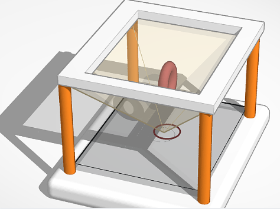
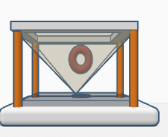
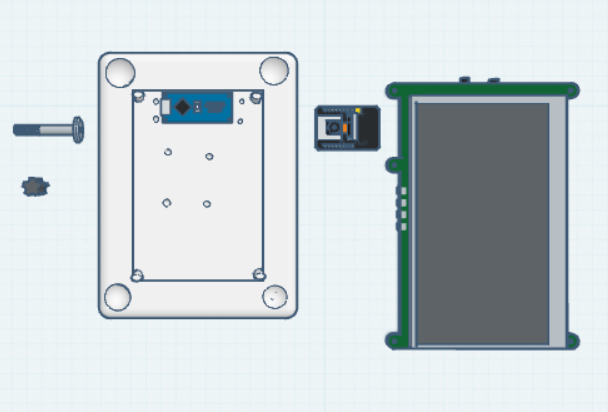

# H.E.L.I.X-Virtual-Intelligence
Inspired by sci-fi metas this project brings the iconic JARVIS concept out of the flat screen and straight into physical space but with ULTRON inspired aesthetic(robotic and cold). 
It’s an interactive AI companion that projects a custom holographic interface and responds to voice and system commands in real-time.
It even responds to hand gestures using computer vision and voice commands.
But I have used lightweight models which might reduce the quality of reasoning,visual and performance. Doing so would let this project run on low-end laptops.
# HOW IT WORKS?
**1. Voice Recognition:**
It uses Vosk to process voice commands given by the user.

**2. AI Processing and Logic:**
The transcribed text is sent to a Python backend powered by Meta's Llama hosted by Groq API.
AI parses and analyzes the request.

**3. Holographic Display (The Hologram):**
I planned to use Raspberry pi LCD display but dropped the idea because it would restrict the hologram to roughly 2.5 cm.
Instead I decided to make this project more impactful , I will be using 15.6 inch HDMI display that could give me a larger hologram display and make it easier to interact with.

## 4. Hardware Control & Interaction:
**STANDALONE HOST COMPUTE -:** Raspberry pi runs the python backend, handles Vosk offline voice recognition, manages MediaPipe/OpenCV gesture tracking via USB webcam and outputs visuals to the 15.6 inch display.

**AI LOGIC AND REASONING-:**   Transcribed voice inputs are sent via Raspberry Pi to Meta's LLaMa hosted on the high speed groq API.

**MICROCONTROLLER (ARDUINO NANO)-:** Connected to the Raspberry Pi via USB serial to execute low-level hardware triggers and control status LEDs.

And the 15.6 inch Full HD display projects inverted 4-quadrant imagery onto a central 4-sided acrylic reflector pyramid.

## 4.Assembly & Mounting specs
**BASE PLATE :** Integrated mounting slots for Arduino Nano , wire routing channels, and base leg support.
**OPTICAL FRAME:** Four vertical corner pillars elevate the 15.6 inch monitor directly above the 4-sided acrylic reflector pyramid.
**Mechanical Fasteners:** Rigidly assembled using 16× M5x40 Flathead Steel Bolts and matching M5 Hex Nuts without relying on adhesives.

> The full CAD is available in ['/cad/assembly.step<\'](./software/cad/Helix_Model.step)

5. Complete BOM 
# H.E.L.I.X - Bill of Materials (BOM)
| Item | Description | Est. Cost(USD) |
| :--- | :--- | :--- |
| **Raspberry Pi 4 / 5** | Core processor that will be running Python & Backend | ~$60 - $80 |
| **Arduino Nano** | Microcontroller connected via USB serial for LED and hardware control | ~$5-$10|
| **15.6-Inch Portable HDMI monitor** | Full HD screen that will give significantly bigger display | ~$88 |
| **Acrylic Sheet (Pyramid)** | Custom cut for the 3D holographic projection | ~$15 - $20 |
| **USB Webcam** | For computer vision and hand gestures | ~$15 - $25 |
| **Arduino Nano / Uno** | Controls physical LEDs and hardware peripherals | ~$5 - $10 |
| **USB Microphone & Speaker** | Audio input/output for Helix's voice | ~$15 - $20 |
| **3D Printed Chassis & Display**| Structural Frame , Top Display bezel and corner pillar (PLA)|~$8-$12|
|**M5x40 Flathead Bolts & M5 Hex Nuts 16 sets** | Steel Fasteners for securing pillars and base plate| ~$3 - $5|
|**Jumper wires and Power Wiring Harness (1kit)**| Internal cabling for Arduino,camera and power routing|$2-$3|
| **Total Estimated Budget** | | **~$216 - $273** |

> For Machine readable version see ['BOM.csv'](./software/BOM.csv)


**IMPORTANT**
I have used AI(Gemini, GitHub Copilot) for certain code generation that automated and sped up my work and also for debugging (which took me hours even after using AI) 

**ASSEMBLY (CHASSIS)**




** COMPONENTS AND MOUNTING**



## 📂 Repository Structure

```text
.
├── BOM.csv
├── BOM.md
├── README.md
├── .gitignore
├── Software/
│   └── Backend/
│       ├── model/
│       └── software/
│           └── vision/
│               └── software/
│                   └── arduino/
│                       ├── helix_firmware.ino
│                       ├── requirements.txt
│                       ├── hand_tracking.py
│                       ├── listener.py
│                       ├── main.py
│                       ├── tts.py
│                       └── voicetest.py
└── cad/
    ├── Helix_Model.step
    ├── components.png
    ├── Isometric_view.png
    ├── front_view.png
    └── HELIX Hardware Architecture Setup (rough)
