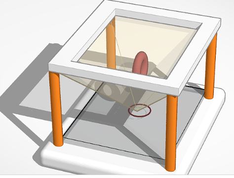
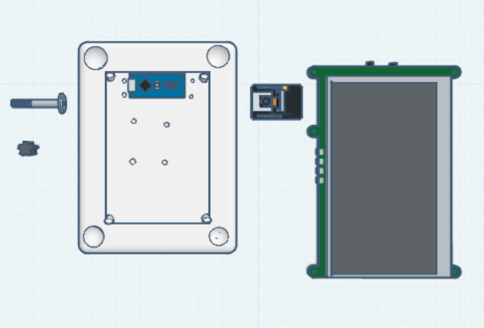

# H.E.L.I.X-Virtual-Intelligence
Inspired by sci-fi movies this project brings the iconic JARVIS concept out of the flat screen and straight into reality but with ULTRON inspired aesthetic(robotic and cold). 
It’s an interactive AI companion that projects a custom holographic interface and responds to voice and system commands in real-time.
It even responds to hand gestures using computer vision and voice commands.
But I have used lightweight models which might reduce the quality of reasoning, visuals and performance. Doing so would let this project run on low-end laptops.

# Why did I make this?
 Every tech-savvy person has a dream of working like a scientist/engineer in sci-fi movies. But in reality, holograms need high tech lab environment and lasers we couldn't afford. But we could keep it pocket-friendly by using the Pepper-ghost effect and low-key fulfill our dream of working like Tony Stark. 
 
# HOW IT WORKS?
**1. Voice Recognition:**
It uses Vosk to process voice commands given by the user.

**2. AI Processing and Logic:**
The transcribed text is sent to a Python backend powered by Meta's Llama hosted by Groq API.
AI parses and analyzes the request.

**3. Holographic Display (The Hologram):**
I planned to use Raspberry pi LCD display but dropped the idea because it would restrict the hologram to roughly 2.5 cm.
Instead I decided to make this project more impactful , I will be using 15.6 inch HDMI display that could give me a larger hologram display and make it easier to interact with.

## 4. Hardware Control & Interaction:
**STANDALONE HOST COMPUTE -:** Raspberry pi runs the python backend, handles Vosk offline voice recognition, manages MediaPipe/OpenCV gesture tracking via USB webcam and outputs visuals to the 15.6 inch display.

**AI LOGIC AND REASONING-:**   Transcribed voice inputs are sent via Raspberry Pi to Meta's LLaMA hosted on the high speed groq API.

**MICROCONTROLLER (ARDUINO NANO)-:** Connected to the Raspberry Pi via USB serial to execute low-level hardware triggers and control status LEDs.

And the 15.6 inch Full HD display projects inverted 4-quadrant imagery onto a central 4-sided acrylic reflector pyramid.

## 4.Assembly & Mounting specs
1. **BASE PLATE :** Integrated mounting slots for Arduino Nano , wire routing channels, and base leg support.
2. **OPTICAL FRAME:** Four vertical corner pillars elevate the 15.6 inch monitor directly above the 4-sided acrylic reflector pyramid.
3. **Mechanical Fasteners:** Rigidly assembled using 16× M5x40 Flathead Steel Bolts and matching M5 Hex Nuts without relying on adhesives.


## IMPORTANT
**AI usage:**

I have used AI(Gemini, GitHub Copilot) for certain code generation that automated and sped up my work and also for debugging (which took me hours even after using AI). And I don't know C++ :}. I have provided a firmware that enabled Arduino nano's job , that is indeed made with AI but I know the core logic...and all my old projects that needed Arduino saw the same procedure.


**CAD & Hardware constrain:**

Due to hardware performance limits on my primary Laptop, complex desktop CAD suites (such as Autodesk 360) were not viable.

To overcome this the entire model is created on **Onshape**. But initially, I prepared my model on **Tinkercad** as could work with my laptop well but I had to change my idea and prepare another model on Onshape as Forge doesn't accept Tinkercad. Although I provided screenshots of Tinkercad model as they looked lively, and one Onshape screenshot. My laptop wasn't even working properly on Onshape,this device does not support 3D modeling as it relies on **integrated AMD Radeon graphics**.

After a few settings and crash out later I made a lightweight CAD model with **functional physical geometry**. It might look like a block toy but works!


> Download the full CAD available in ['/cad/assembly.step<\'](./software/cad/Helix_Model.step)


## 5. Complete BOM 
# H.E.L.I.X - Bill of Materials (BOM)

| Item | Description | Est. Cost(USD) | Est. Cost(INR) |
| :--- | :--- | :--- | :--- |
| **[Raspberry Pi 5 (4GB)](https://www.amazon.in/dp/B0CX21C8S2)** | Core processor running Python, backend, and computer vision | ~$60 - $80 | ₹9,632 |
| **[Arduino Nano V3](https://robocraze.com/products/arduino-nano-r3-board)** | Microcontroller connected via serial for LED & hardware execution | ~$5 - $10 | ₹185 |
| **[4-Channel Logic Level Converter](https://www.amazon.in/dp/B08246C69X)** | Bi-directional 3.3V <-> 5V logic shifter for safe UART data lines | ~$1 - $2 | ₹29 |
| **[WS2812B RGB LED Module](https://robocraze.com/products/ws2812b-digital-rgb-led-module)** | Addressable RGB status light for system visual feedback | ~$1 - $2 | ₹64 |
| **[15.6-Inch Portable HDMI Monitor](https://www.amazon.in/dp/B0CD35M3S9)** | Full HD screen that will give significantly bigger display | ~$88 | ₹7,299 |
| **[Acrylic Sheet 3mm Clear](https://www.amazon.in/dp/B08XWW4G7R)** | Custom cut for the 3D holographic projection | ~$15 - $20 | ₹399 |
| **[USB Webcam 1080p](https://www.amazon.in/dp/B0892B3VLS)** | For computer vision and hand gestures | ~$15 - $25 | ₹2,499 |
| **[USB Microphone & Speaker Unit](https://www.amazon.in/dp/B09XXK314P)** | Audio input/output for Helix's voice | ~$15 - $20 | ₹2,374 |
| **3D Printed Chassis & Frame** | Structural frame, top display bezel and corner pillars (PLA) | ~$8 - $12 | ₹800 |
| **[M5 Screws & Nuts Assortment Kit](https://www.amazon.in/dp/B08332152M)** | Steel fasteners for securing pillars and base plate (16 sets) | ~$3 - $5 | ₹350 |
| **[Breadboard & Jumper Wire Kit](https://www.amazon.in/dp/B01EV70CTO)** | Internal cabling for Arduino, camera, logic level converter, and power | ~$2 - $3 | ₹209 |


> For Machine readable version see ['BOM.csv'](./software/BOM.csv)

In the CAD of Tinkercad, the pyramid is inverted while in Onshape it's not. This is to show that my assembly could work in any of the ways.

Schematic Overview of Hardware

> For the schematic pdf of the circuit ['/Helix_circuit.pdf\'](./software/cad/Helix_Circuit.pdf)

**ASSEMBLY (CHASSIS)**




** COMPONENTS AND MOUNTING**

Onshape Model 
.png)
Tinkercad
.png)
## 📂 Repository Structure

```text
.
├── BOM.csv
├── BOM.md
├── README.md
├── .gitignore
├── Software/
│   └── Backend/
│       ├── model/
│       └── software/
│           └── vision/
│               └── software/
│                   └── arduino/
│                       ├── helix_firmware.ino
│                       ├── requirements.txt
│                       ├── hand_tracking.py
│                       ├── listener.py
│                       ├── main.py
│                       ├── tts.py
│                       └── voicetest.py
└── cad/
    ├── Helix_Model.step
    ├── components.png
    ├── Isometric_view.png
    ├── front_view.png
    └── HELIX Hardware Architecture Setup (rough)
